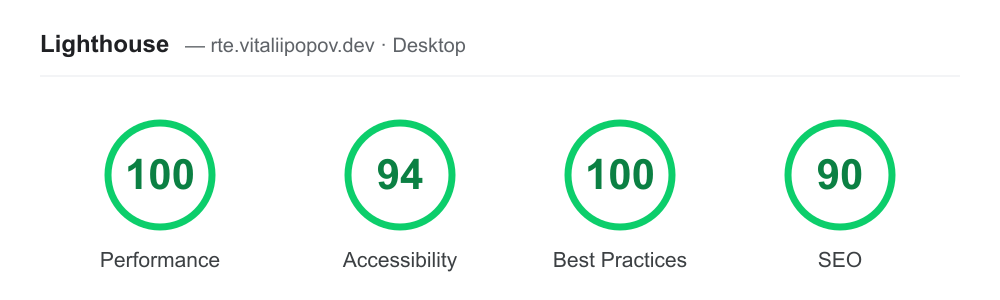

# Rich Text Editor — Contentful App

A custom **PlateJS** (Slate) editor that replaces the native Rich Text field UI and serialises losslessly to/from the **Contentful Rich Text** document model.

It demonstrates the hardest part of a custom Contentful editor: owning the editing surface while still storing schema-valid CDA content. The conversion layer ([`src/transform.ts`](src/transform.ts)) is round-trip tested.

## Performance

Lighthouse (PageSpeed Insights) on the live playground — desktop:



## Features

- **Marks** — bold, italic, underline, inline code
- **Blocks** — paragraph, H1–H3, blockquote, bullet & numbered lists (`ul > li > p`, Contentful-valid nesting), horizontal rule
- **Inline links** — wrap a selection or insert a URL
- **Embeds** — embedded entry / asset blocks inserted via the native Contentful picker (`sdk.dialogs.selectSingleEntry` / `selectSingleAsset`), rendered as cards that resolve the entry/asset title through the CMA
- **Slash menu** — press `/` on an empty block for a keyboard-navigable block picker
- **Sticky toolbar + capped iframe height** — long bodies scroll internally with the toolbar pinned; short bodies stay compact

## How it works

```
Contentful Rich Text document  ──deserialize()──▶  Plate value  ──▶  PlateJS editor
                               ◀──serialize()────  Plate value  ◀──  (debounced onChange)
                                                       │
                                              sdk.field.setValue(document)
```

Plate node types are named to mirror Contentful (`p`, `h1`, `ul`, `li`, `blockquote`, `embedded-entry-block`, …), so the transform is a thin, explicit mapping rather than a guessing game. Marks become boolean leaf props; `hyperlink` ↔ `a`; embeds carry the entry/asset id.

The toolbar is driven by **stable `slate`-core transforms** (the Plate editor is a Slate editor underneath) to stay robust across Plate minor versions.

## Develop

```bash
npm install
npm run dev          # Vite on :5173, configured for ngrok tunneling
# expose it: `ngrok http 5173`, then set the HTTPS URL as the app's
# entry-field location URL in the AppDefinition.
```

## Deploy (Contentful Hosting — no GCP)

```bash
npm run create-app   # one-time: create the AppDefinition (prints the App ID)
npm run upload       # build + upload the bundle to Contentful Hosting
```

CI does this via `.github/workflows/deploy-rich-text-editor.yml` (`npm run upload-ci`).

## Assign to a field

In Contentful: content model → `blogPost` → field `body` (Rich Text) → **Appearance** → select **Rich Text Editor**. Enable the embed node types you want under the field's **Validations**.

## Notes & limits (lean build)

- Scope is a clean, generic editor — not every block type. List editing is basic (single-block toggle); nested list exit/merge isn't fully handled.
- Bundle is ~425 kB gzipped (PlateJS) and served from Contentful Hosting, not to site visitors.
- This is a clean-room implementation built on the public PlateJS + Contentful APIs; it contains no proprietary editor code.
